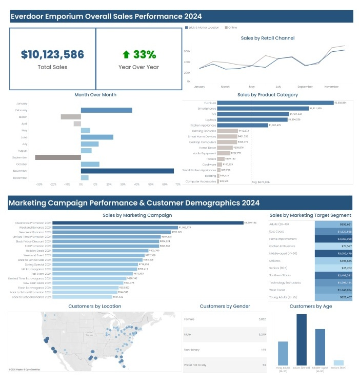
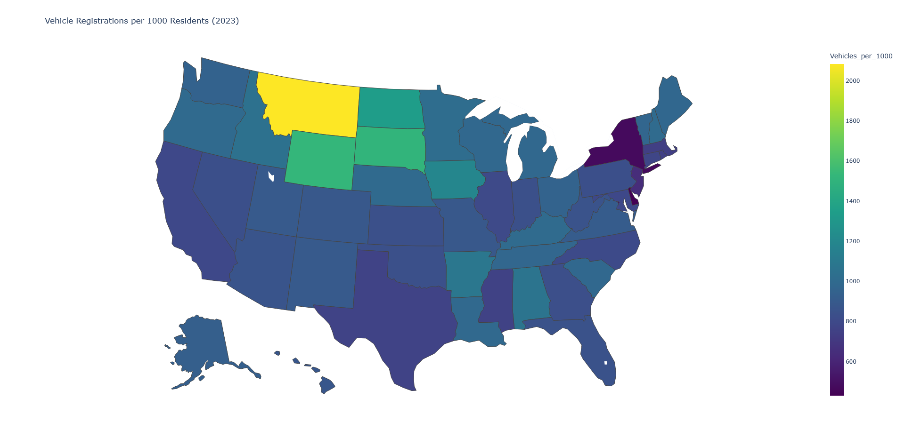

# Scott Solik
## Data Projects Portfolio
With over 15 years of experience as a business analyst bridging business and technology, I've expanded my skillset to include SQL, Tableau, Excel, and Python, allowing me to dive deep into data, uncover patterns, and tell compelling stories that drive smarter decisions.

This portfolio showcases a selection of hands-on projects where I've applied analysis, visualization, and problem-solving techniques to explore data and present insights.
Thanks for visiting—feel free to explore, connect, or reach out.

## Projects
### [Everdoor Emporium Project](https://ssolik.github.io/everdoor_emporium.html)
*Excel | SQL | Tableau*  
  
This project was designed to explore and analyze customer engagement and marketing performance for Everdoor Emporium in 2024 across both digital and physical channels.  
  

### [Motor Vehicle Registrations 2000 – 2023](https://ssolik.github.io/motor_vehicles_registrations.html) 
*Python*  
  
This project examines motor vehicle registrations in the U.S. for the years 2000-2023.  
  

### [World Life Expectancy](https://ssolik.github.io/world_life_expectancy.html)  
*SQL | Tableau*  
This project examines the average life expectancy in 193 countries for the years 2007 – 2022.  
  

  

## Contact Me
[View My Resume](https://github.com/ssolik/ssolik.github.io/blob/main/docs/Scott_Solik_Resume.pdf)  
<a href="mailto:ssolik@gmail.com">ssolik@gmail.com</a>  
<a href="http://www.linkedin.com/in/scott-solik">LinkedIn</a>

&copy; 2025 Scott Solik. All rights reserved.  
Design: <a href="http://html5up.net">HTML5 UP</a>